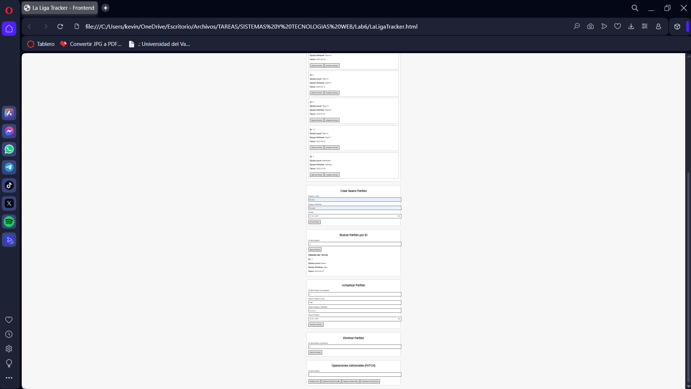

# 🏆 LeagueMatches API

API desarrollada en Laravel para gestionar los partidos de una liga.  
Esta API permite crear, visualizar, actualizar y eliminar partidos mediante endpoints RESTful.



---

## 📦 Tecnologías utilizadas

- **Laravel 10+**  
- **PostgreSQL**  
- **Docker & Docker Compose**  
- **Nginx** (para producción)  
- **SSL** (certificados manuales o Let's Encrypt)

---

## 🚀 Endpoints de la API
  
- Obtener todos los partidos.
```bash
GET /api/matches
```

- Obtener un partido por ID.
```bash
GET /api/matches/{id}
```

- Crear un nuevo partido.
```bash
POST /api/matches
```

- Actualizar un partido existente.
```bash
PUT /api/matches/{id}
```

- Eliminar un partido.
```bash
DELETE /api/matches/{id}
```

---

## 🛠️ Estructura del Proyecto

- `/app/Http/Controllers/LeagueMatchController.php`: Controlador con la lógica de los partidos.
- `/routes/api.php`: Definición de rutas del API.
- Archivos de configuración Docker:  
  - `Dockerfile` (producción)  
  - `Dockerfile.dev` (desarrollo)  
  - `docker-compose.yml`  
  - `docker-compose.override.yml`  
- Archivos de entorno:  
  - `.env.example` (incluye la configuración para correr localmente)

---

## 🚧 Despliegue y Ejecución Local

### 1. Clonar el repositorio

```bash
cd /ruta/donde/quieras/guardar/el/proyecto
git clone https://github.com/tu-usuario/tu-repo.git league-matches-api
cd league-matches-api
```

### 2. Configurar variables de entorno

Copia el archivo de ejemplo y edítalo:

```bash
cp .env.example .env
nano .env
```

Verifica (o ajusta) estos valores para desarrollo:

```dotenv
APP_NAME=LeagueMatches
APP_ENV=local
APP_KEY=         # Se generará con artisan
APP_DEBUG=true
APP_URL=http://localhost:8100

DB_CONNECTION=pgsql
DB_HOST=postgres_database
DB_PORT=5432
DB_DATABASE=league
DB_USERNAME=admin
DB_PASSWORD=12345
```

### 3. Levantar los contenedores

```bash
docker compose up --build -d
```

### 4. Verificar contenedores y ejecutar comandos de Laravel

```bash
docker ps
docker compose exec app php artisan migrate
docker compose exec app php artisan config:cache
docker compose exec app php artisan key:generate
```

### 5. Acceder a la API

```
http://localhost:8100
```

---

## ⚙️ Archivos de Configuración Docker

Incluye ejemplos para `docker-compose.yml`, `docker-compose.override.yml` y `.env.example`

---

## 📄 Notas adicionales

- Consulta `DEPLOY.md` para despliegue en producción
- Usa SSH para conectar con la base de datos desde herramientas externas como TablePlus

---

## 🧑‍💻 Autor

Desarrollado por Kevin (a.k.a. DerNait)
