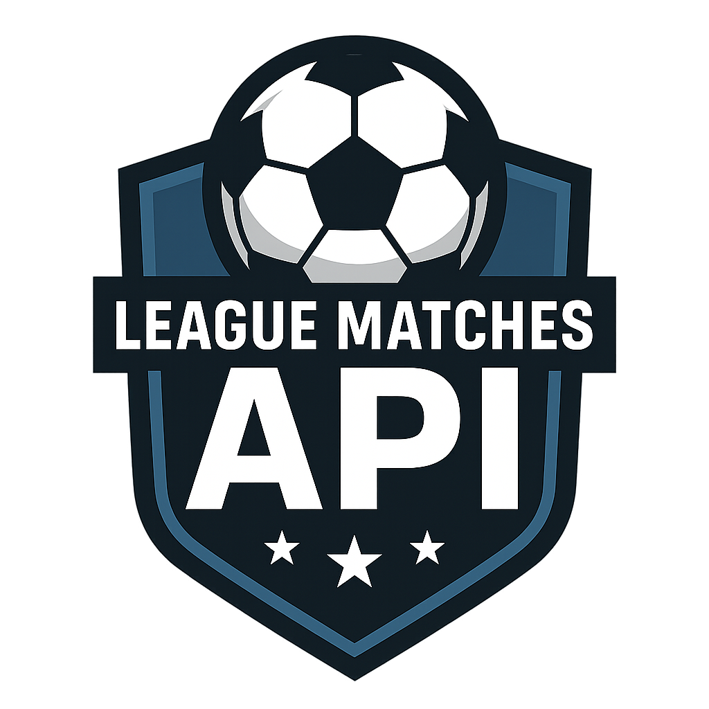

<!-- Improved compatibility of back to top link: See: https://github.com/othneildrew/Best-README-Template/pull/73 -->
<a id="readme-top"></a>

[![Contributors][contributors-shield]][contributors-url]

<!-- PROJECT LOGO -->
<br />
<div align="center">
  <a href="https://github.com/DerNait/halo-api">
    
  </a>

<h3 align="center">LeagueMatches API</h3>

  <p align="center">
    API en Laravel para gestionar los partidos de una liga.
  </p>
</div>


<details>
  <summary>Tabla de contenidos</summary>
  <ol>
    <li><a href="#about-the-project">Acerca del proyecto</a>
      <ul><li><a href="#built-with">Tecnologías</a></li></ul>
    </li>
    <li><a href="#getting-started">Comenzando</a>
      <ul>
        <li><a href="#prerequisites">Requisitos previos</a></li>
        <li><a href="#installation">Instalación</a></li>
      </ul>
    </li>
    <li><a href="#usage">Uso</a></li>
    <li><a href="#roadmap">Roadmap</a></li>
    <li><a href="#contributing">Contribuciones</a></li>
    <li><a href="#license">Licencia</a></li>
    <li><a href="#contact">Contacto</a></li>
    <li><a href="#acknowledgments">Agradecimientos</a></li>
  </ol>
</details>


## About The Project


LeagueMatches API permite crear, visualizar, actualizar y eliminar partidos usando una API REST en Laravel. También permite registrar tarjetas, goles y tiempo extra en partidos.

<p align="right">(<a href="#readme-top">volver arriba</a>)</p>


### Built With

* [![Laravel][Laravel.com]][Laravel-url]
* [![PostgreSQL][PostgreSQL.com]][PostgreSQL-url]
* [![Docker][Docker.com]][Docker-url]
* [![Nginx][Nginx.com]][Nginx-url]

<p align="right">(<a href="#readme-top">volver arriba</a>)</p>


## Getting Started

### Prerequisites

- Docker y Docker Compose instalados

### Installation

```bash
git clone https://github.com/DerNait/halo-api.git
cd halo-api
cp .env.example .env
cp docker-compose.yml.example docker-compose.yml
cp docker-compose.override.yml.example docker-compose.override.yml
```

Editar `.env` y archivos docker si es necesario:
```bash
vi .env
vi docker-compose.yml
vi docker-compose.override.yml
```

Variables de entorno comunes:
```dotenv
APP_URL=http://localhost:8080
DB_CONNECTION=pgsql
DB_HOST=postgres_database
DB_PORT=5432
DB_DATABASE=league
DB_USERNAME=admin
DB_PASSWORD=12345
```

```bash
docker compose up --build -d
docker compose exec app php artisan migrate
docker compose exec app php artisan key:generate
```

Accede a:
```
http://localhost:8080
```

<p align="right">(<a href="#readme-top">volver arriba</a>)</p>


## Usage

### Endpoints disponibles

```http
GET     /api/matches                  # Listar todos los partidos
GET     /api/matches/{id}             # Obtener partido por ID
POST    /api/matches                  # Crear nuevo partido
PUT     /api/matches/{id}             # Actualizar un partido
DELETE  /api/matches/{id}            # Eliminar partido
PATCH   /api/matches/{id}/goals      # +1 gol
PATCH   /api/matches/{id}/yellowcards # +1 tarjeta amarilla
PATCH   /api/matches/{id}/redcards    # +1 tarjeta roja
PATCH   /api/matches/{id}/extratime   # +5 minutos extra
```

Documentación Swagger en: [`/api/documentation`](http://localhost:8080/api/documentation)  
Documentación LLM en: `llm.txt`
<br>
[](https://www.postman.com/grey-escape-180059/workspace/league-matches-api/collection/42793565-b6da809f-76f7-4484-a850-21963d84a28b?action=share&creator=42793565)

<p align="right">(<a href="#readme-top">volver arriba</a>)</p>


## Roadmap

- [x] Registro de partidos
- [x] Registro de goles y tarjetas
- [ ] Filtros por fecha y equipo
- [ ] Autenticación y roles

<p align="right">(<a href="#readme-top">volver arriba</a>)</p>


## Contributing

¡Por el momento el API se encuentra completa! por lo que ya no se requieren contribuciones por ahora.

<p align="right">(<a href="#readme-top">volver arriba</a>)</p>


## License

Distribuido bajo la licencia MIT. Ver `LICENSE.txt` para más info.

<p align="right">(<a href="#readme-top">volver arriba</a>)</p>


## Contact

Kevin (a.k.a. DerNait) - kev.villagran24@gmail.com  
Proyecto: [LeagueMatches API](https://github.com/DerNait/league-matches-api)

<p align="right">(<a href="#readme-top">volver arriba</a>)</p>


## Acknowledgments

- [Best README Template](https://github.com/othneildrew/Best-README-Template)
- [Laravel Docs](https://laravel.com/docs)
- [Docker](https://docs.docker.com/)

<p align="right">(<a href="#readme-top">volver arriba</a>)</p>


<!-- MARKDOWN LINKS & IMAGES -->
[Laravel.com]: https://img.shields.io/badge/Laravel-FF2D20?style=for-the-badge&logo=laravel&logoColor=white
[Laravel-url]: https://laravel.com

[contributors-shield]: https://img.shields.io/github/contributors/DerNait/halo-api.svg?style=for-the-badge
[contributors-url]: https://github.com/DerNait/

[product-screenshot]: image.png

[PostgreSQL.com]: https://img.shields.io/badge/PostgreSQL-336791?style=for-the-badge&logo=postgresql&logoColor=white
[PostgreSQL-url]: https://www.postgresql.org/

[Docker.com]: https://img.shields.io/badge/Docker-2496ED?style=for-the-badge&logo=docker&logoColor=white
[Docker-url]: https://www.docker.com/

[Nginx.com]: https://img.shields.io/badge/Nginx-009639?style=for-the-badge&logo=nginx&logoColor=white
[Nginx-url]: https://www.nginx.com/
